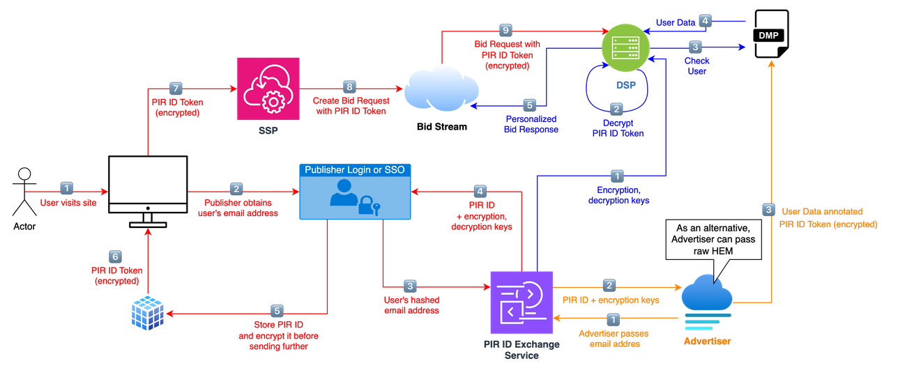

# Polski Identyfikator Reklamowy (PIR)

## [What is PIR?](what-is-pir.md)
## [Technical Guide](technical-guide%2Findex.md)
### Introduction
- [Overview](technical-guide%2Foverview.md)
- [Glossary](technical-guide%2Fglossary.md)

### XID generation
- [How to integrate?](technical-guide%2Fhow-to-integrate.md)
- [Generating XID](technical-guide%2Fgenerating-xid.md)
- [Regenerating XID](technical-guide%2Fregenerating-xid.md)
- [Properties](technical-guide%2Fproperties.md)

### Tokenisation
- [Tokenisation](technical-guide%2Ftokenisation.md)
- [Bidstream integration](technical-guide%2Fbidstream.md)

