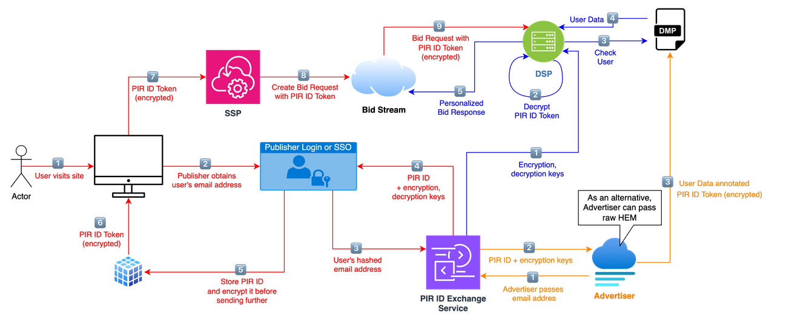

# Polski Identyfikator Reklamowy (PIR)

## [What is PIR?](what-is-pir.md)
## [Technical Guide](/current)
### Introduction
- [Overview](/current/overview.md)
- [Glossary](/current/glossary.md)

### XID generation
- [How to integrate?](/current/how-to-integrate.md)
- [Generating XID](/current/generating-xid.md)
- [Regenerating XID](/current/regenerating-xid.md)
- [Properties](/current/properties.md)

### Tokenisation
- [Tokenisation](/current/tokenisation.md)
- [Bidstream integration](/current/bidstream.md)

